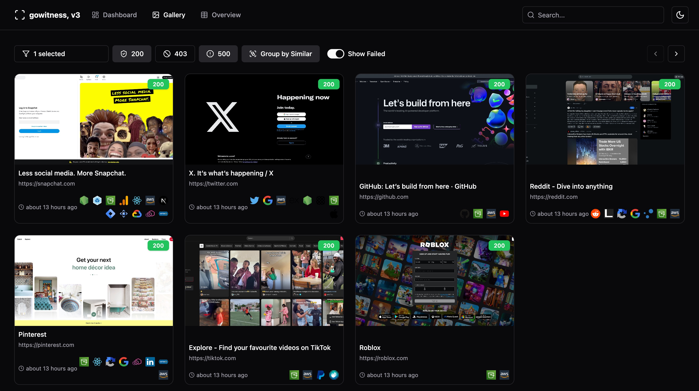
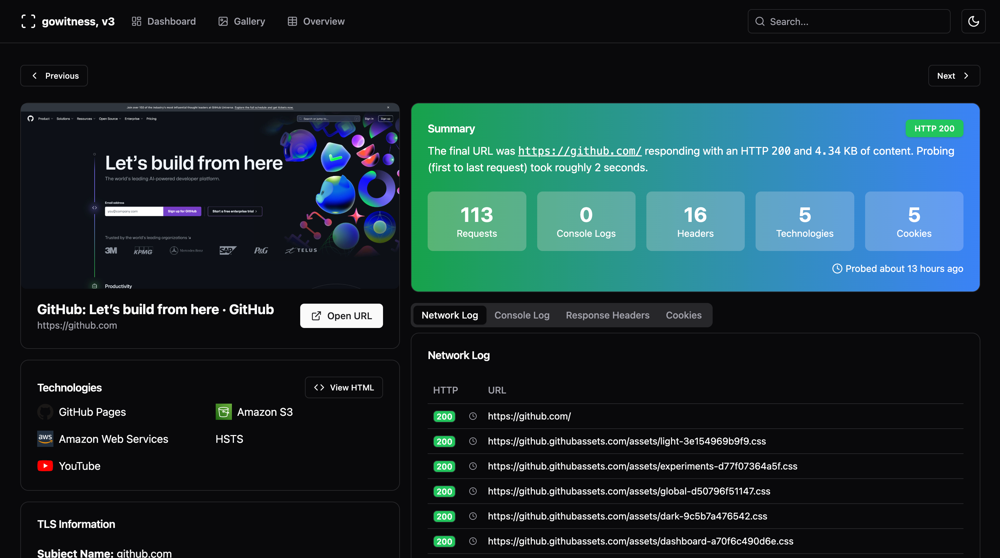
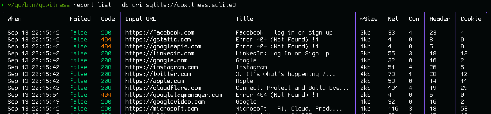

## introduction

This is a website screenshot utility written in Golang, that uses Chrome Headless to generate screenshots of web interfaces using the command line, with a handy report viewer to process results. Both Linux and macOS is supported, with Windows support mostly working.

## features

The main goal is to take website screenshots (**and do that well!**), while optionally saving any information it gathered along the way. That said, a short list of features include:

- Take website screenshots, obviously..., but fast and accurate!
- Scan a list of URLs, CIDRs, Nmap Results, Nessus Results and more.
- Ability to grab and save data (i.e., a request log, console logs, headers, cookies, etc.)
- Write data to many formats (sqlite database, jsonlines, csv, etc.)
- An epic web-based results viewer (if you saved data to SQLite) including a fully featured API!
- And many, many more!

## screenshots

